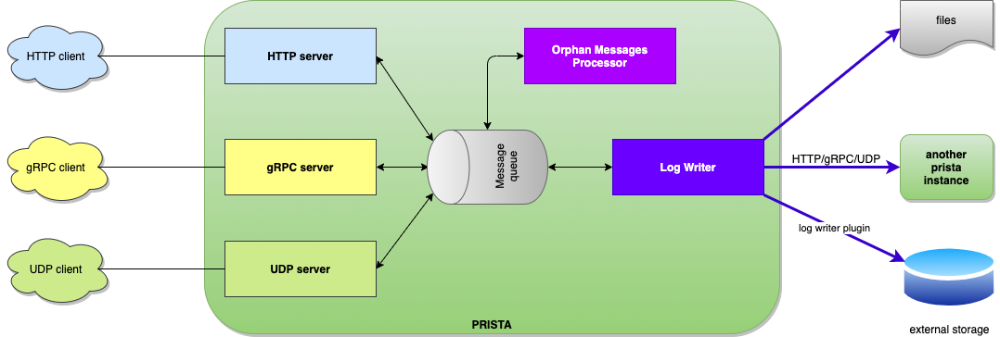

# prista

A log collector service.

Latest release version: `0.1.2`. See [RELEASE-NOTES.md](RELEASE-NOTES.md).

## Introduction

`prista` is a service that client can throw logs in. Logs are then either stored or forwarded to another sink.

Each log entry consists of a `category` and a log `message`.
- `category` used to group logs together.
- `message` is the actual log content which is an arbitrary string.

Client can drop logs onto `prista` via 3 gateways:

**HTTP Gateway**

Make `POST` or `PUT` HTTP request to `/api/log` with the following:
- Content type: `application/json`
- Body: `category` and `message` encoded in a JSON format `{"category":<category-name>, "message":<log-message>}`

By default, HTTP gateway listens on port `8080`.

**gRPC Gateway**

See [service description file](grpc/api_service.proto).

By default, gRPC gateway listens on port `8090`.

**UDP Gateway**

Send log entry in the following format to UDP gateway: `<category><\t><message>` (category name, followed by a tab character and then the log message).

By default, UDP gateway listens on port `8070`.

## Features & TODO

- [x] Collect logs via HTTP, gRPC and UDP service
- [x] Log writer to write logs to file:
  - [x] Time-based file rotation
  - [ ] Size-based rotation
- [x] Log writer to forward logs to another `prista`
- [ ] Log writer that is a chain of log writers
- [ ] Plugin architecture for log writer


## How It Works




## Installation

### Build from source

Require `git` client and `go` v1.13+

```shell script
% git clone https://github.com/btnguyen2k/prista
Cloning into 'prista'...
...

% cd prista
prista % go build main.go
```

### Build Docker image

Require `git` client and `go` v1.13+ and Docker.

```shell script
% git clone https://github.com/btnguyen2k/prista
Cloning into 'prista'...
...

% cd prista
prista % docker build --force-rm -t prista:<version> .
Sending build context to Docker daemon  14.26MB
Step 1/12 : FROM golang:1.13-alpine AS builder
...
```

### Start/Stop prista

**Standalone**

Run executable file `main` (generated after successful build) to start `prista`:

```shell script
prista $ ./main
yyyy/MM/dd HH:mm:ss No environment APP_CONFIG found, fallback to [./config/application.conf]
yyyy/MM/dd HH:mm:ss Loading configurations from file [./config/application.conf]
yyyy/MM/dd HH:mm:ss Loading configurations from file [commons.conf]
yyyy/MM/dd HH:mm:ss Loading configurations from file [log.conf]
yyyy/MM/dd HH:mm:ss Intializing FileLogWriter for category [default]...
yyyy/MM/dd HH:mm:ss Starting [prista v0.1.0] HTTP server on [0.0.0.0:8080]...

   ____    __
  / __/___/ /  ___
 / _// __/ _ \/ _ \
/___/\__/_//_/\___/ v4.1.14
High performance, minimalist Go web framework
https://echo.labstack.com
____________________________________O/_______
                                    O\
yyyy/MM/dd HH:mm:ss Starting [prista v0.1.0] UDP server on [0.0.0.0:8070]...
⇨ http server started on [::]:8080
yyyy/MM/dd HH:mm:ss Starting [prista v0.1.0] gRPC server on [0.0.0.0:8090]...
```

Press `Ctrl-C` to stop `prista`.

**Docker**

Start a container from `prista` image, mapping port 8070, 8080 and 8090:

```shell script
% docker run -d -p 8070:8070/udp -p 8080:8080 -p 8090:8090 prista:<version>
```

Docker hub: https://hub.docker.com/r/btnguyen2k/prista


## Configurations

By default `prista` loads application configurations from file `./conf/application.conf`.

Summary of configurations:

```
app {
  # this section connfigures application name, description and version number.
}

server {
  http {
    # this section configures HTTP gateway
  }

  grpc {
    # this section configures gRPC gateway
  }

  udp {
    # this section configures UDP gateway
  }
}

# "temp" directory to buffer incoming messages
temp_dir = "./temp"

# Number of threads to handle messages send via UDP
num_udp_threads = 4

# Max number of concurrent log writes
max_write_threads = 128

log {
  default {
    # log writer configuration for "default" category.
    # "Default" category is where logs that do not belong to any category go to.
    type = "file"
    file {
      # configuration for "file"-type log writer
    }
  }
}
```

## Built-in Log Writers

### "file" log writer

This log writer persists log messages to files on disk in text-based format.

To enable "file" log writer for a category, set config key `log.<category>.type="file"`.
Then, log writer's configurations are loaded from `log.<category>.file` block.

Detailed configurations of "file" log writer.

| Key           | Require | Default Value | Description |
|---------------|:-------:|:-------------:|-------------|
| root          | yes     |               | Root directory to store log files. If the directory does not exist, it will be automatically created. |
| file_pattern  | yes     |               | Name of the log file. It accepts Go-style of datetime format. Therefore, to rotate log file every hour, an example of file name pattern would be `default.log-20060102_15`. |
| log_type      |         | json          | (*) Format of log file content: `tsv` or `json`. |
| retry_seconds |         | 60            | If log entry is failed to be written, the write is retrying for (at least) a number of seconds before the log entry is discarded. `0` means 'no retry' and a negative value means 'retry forever'. |

(*) Log file format:
- `tsv`: one line per log entry in the following format `<category-name><tab-character><log-message>`
- `json`: one line per log entry in the following format `{"category":<category-name>, "message": <log-message>}`

### "forward" log writer

This log writer forwards log entries to another `prista` instance.

To enable "forward" log writer for a category, set config key `log.<category>.type="forward"`.
Then, log writer's configurations are loaded from `log.<category>.forward` block.

Detailed configurations of "forward" log writer.

| Key           | Require | Default Value | Description |
|---------------|:-------:|:-------------:|-------------|
| destination   | yes     |               | (*) Destination to forward log entries to. |
| retry_seconds |         | 60            | If log entry is failed to be written, the write is retrying for (at least) a number of seconds before the log entry is discarded. `0` means 'no retry' and a negative value means 'retry forever'. |

(*) Destination is one of the following:
- `udp://host:port`: forward log entries to another `prista` instance via UDP.
- `grpc://host:port`: forward log entries to another `prista` instance via gRPC.
- `http://host:port` or `https://host:port`: forward log entries to another `prista` instance via HTTP(s) request. Note: destinated `prista` must be `v0.1.1` or higher.

## LICENSE & COPYRIGHT

See [LICENSE.md](LICENSE.md).
